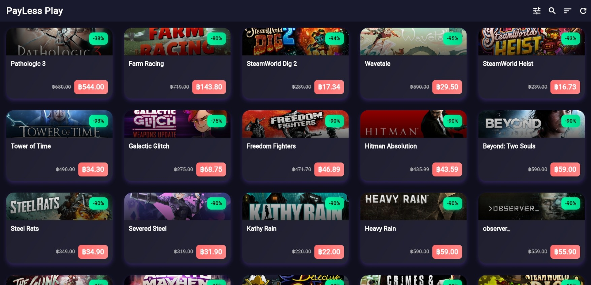
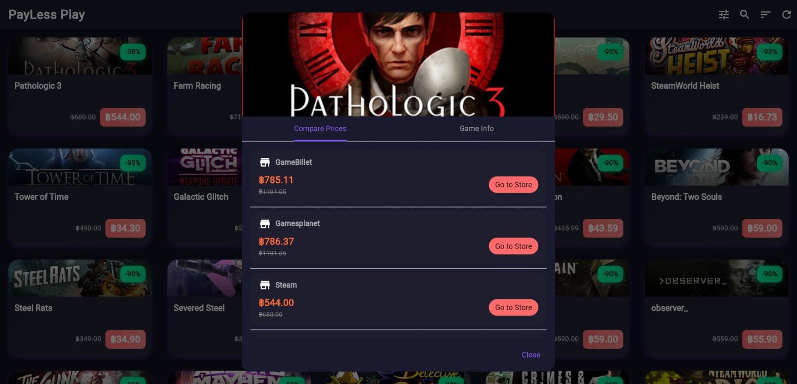
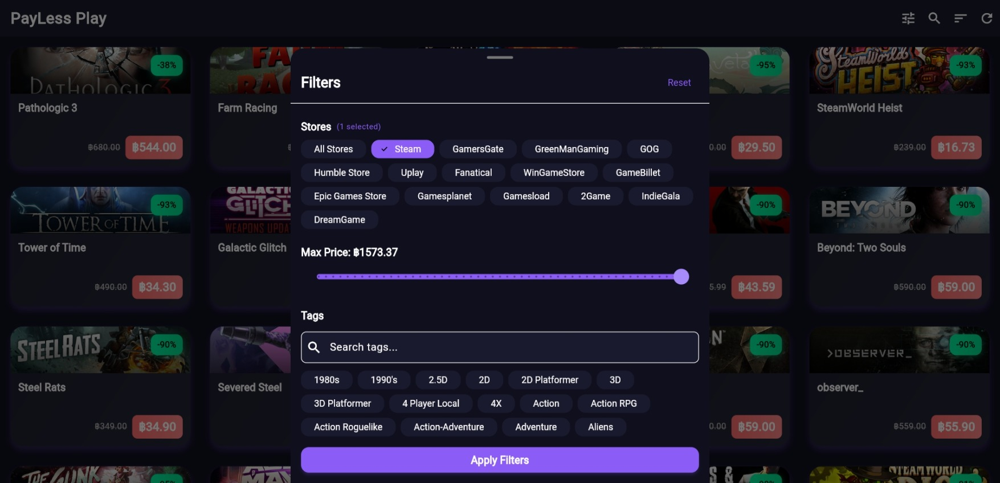
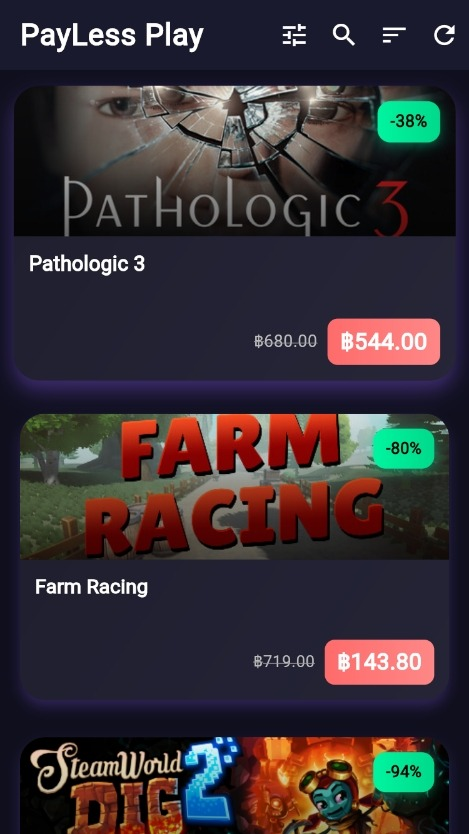
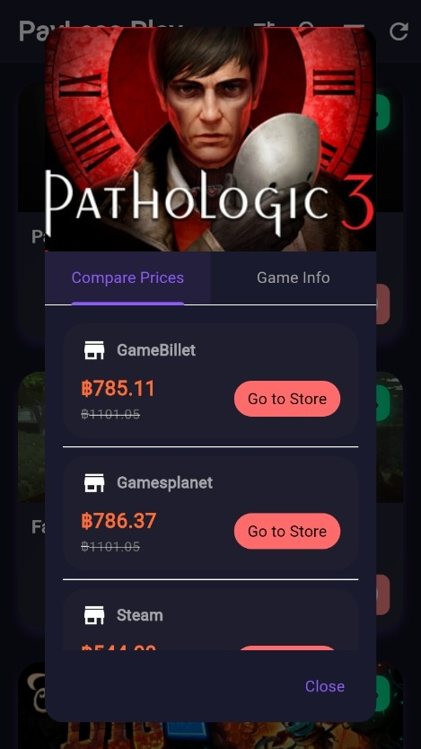
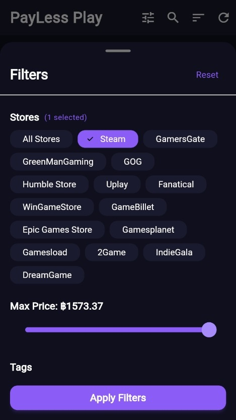

# 🎮 PaylessPlay

**PaylessPlay** is a Flutter web application that helps gamers discover the best video game deals from multiple stores. Browse, filter, and find amazing discounts on your favorite games with real-time pricing data powered by the CheapShark and Steam APIs.


<div align="center">

## [**Live Demo - Try it Now!**](https://paylessplay.web.app/)

**[https://paylessplay.web.app/](https://paylessplay.web.app/)**

</div>

---

## ✨ Features

### 🔍 Smart Deal Discovery
- **Real-Time Deals**: Browse the latest game deals from multiple online stores
- **Advanced Search**: Search for specific games by title
- **Smart Filtering**: Filter by discount percentage, price range, and store
- **Infinite Scroll**: Seamless browsing with automatic pagination

### 💰 Price Intelligence
- **Multi-Currency Support**: Automatic currency conversion based on your location
- **Savings Calculator**: See exactly how much you save on each deal
- **Price Comparison**: Compare prices across different stores

### 🎯 Game Information
- **Steam Integration**: Rich game details including tags, categories, and descriptions
- **Metacritic Scores**: View critic ratings for informed decisions
- **Steam Reviews**: See community ratings and review counts
- **High-Quality Images**: Game headers and screenshots from Steam

### 🛍️ Store Integration
- **Multi-Store Support**: Aggregates deals from major PC game retailers
- **Direct Purchase Links**: One-click access to store pages
- **Store Filtering**: Focus on your preferred retailers

### 🎨 User Experience
- **Dark Theme**: Beautiful, eye-friendly dark interface
- **Light Theme**: Beautiful, eye-friendly light interface
- **Responsive Design**: Optimized for web browsers
- **Location-Aware**: Automatic region detection for accurate pricing

---

## 📸 Screenshots

### 🖥️ Web Version

<div align="center">

#### Main View


#### Game Details


#### Filters


</div>

### 📱 Mobile Version

<div align="center">

#### Main View


#### Game Details


#### Filters


</div>

---

### Prerequisites

Before you begin, ensure you have the following installed:

- **Flutter SDK** (3.7.2 or higher)
  - [Download Flutter](https://flutter.dev/docs/get-started/install)
  - Verify installation: `flutter doctor`

- **Dart SDK** (included with Flutter)

- **Git** (for cloning the repository)

- **A code editor** (VS Code, Android Studio, or IntelliJ IDEA recommended)

### Installation

1. **Clone the repository**
   ```bash
   git clone https://github.com/yourusername/paylessPlay.git
   cd paylessPlay
   ```

2. **Install dependencies**
   ```bash
   flutter pub get
   ```

3. **Run the app**
   ```bash
   # For development (web)
   flutter run -d chrome
   
   # For other platforms
   flutter run
   ```

---

## 🏗️ Project Structure

```
paylessPlay/
├── lib/
│   ├── main.dart                 # App entry point
│   ├── models/                   # Data models
│   │   ├── deal.dart            # Deal model
│   │   ├── store.dart           # Store model
│   │   └── steam_game_detail.dart # Steam game details
│   ├── pages/                    # App screens
│   │   └── deals_page.dart      # Main deals listing page
│   ├── services/                 # API and business logic
│   │   ├── cheapshark_service.dart   # CheapShark API integration
│   │   ├── steam_service.dart        # Steam API integration
│   │   ├── currency_service.dart     # Currency conversion
│   │   └── location_service.dart     # Geo-location detection
│   ├── widgets/                  # Reusable UI components
│   │   ├── deal_card.dart       # Deal display card
│   │   ├── filter_sheet.dart    # Filter bottom sheet
│   │   └── game_detail_dialog.dart   # Game details modal
│   └── theme/                    # App theming
│       └── app_theme.dart       # Theme configuration
├── test/                         # Test files
├── web/                          # Web-specific files

```

---

## 🔧 Technologies & Dependencies

### Core Framework
- **Flutter** - UI framework
- **Dart** - Programming language

### Firebase Services
- `firebase_core` - Firebase core functionality
- `firebase_auth` - User authentication
- `cloud_firestore` - NoSQL database
- `firebase_storage` - File storage

### Networking & APIs
- `http` - HTTP requests for API calls
- **CheapShark API** - Game deals aggregation
- **Steam API** - Game details and metadata

### Utilities
- `url_launcher` - Open store links in browser
- `intl` - Internationalization and formatting
- Custom location service for region detection
- Custom currency conversion service

---

## 🌐 API Integration

### CheapShark API
PaylessPlay uses the [CheapShark API](https://apidocs.cheapshark.com/) to fetch game deals:
- **Deals Endpoint**: Fetches current game deals with pricing
- **Stores Endpoint**: Lists available stores
- **Game Lookup**: Search for specific games

### Steam API
Integration with Steam for enhanced game information:
- **App Details**: Rich game metadata, tags, and categories
- **App Search**: Find Steam App IDs by game title
- **Screenshots**: High-quality game images

---


## 📁 Key Files

| File | Description |
|------|-------------|
| `lib/main.dart` | Application entry point |
| `lib/pages/deals_page.dart` | Main page with deals grid |
| `lib/services/cheapshark_service.dart` | Deal fetching logic |
| `lib/services/steam_service.dart` | Steam API integration |
| `lib/services/currency_service.dart` | Multi-currency support |
| `lib/widgets/deal_card.dart` | Individual deal card UI |
| `lib/widgets/game_detail_dialog.dart` | Game details popup |
| `firebase.json` | Firebase hosting configuration |
| `firestore.rules` | Database security rules |
| `storage.rules` | Storage security rules |
| `DEPLOYMENT.md` | Detailed deployment guide |


---

## 🙏 Acknowledgments

- **CheapShark API** - For providing comprehensive game deal data
- **Steam** - For game metadata and images
- **Flutter Team** - For the amazing framework
- **Firebase** - For backend infrastructure

---


**Happy Gaming! 🎮**
